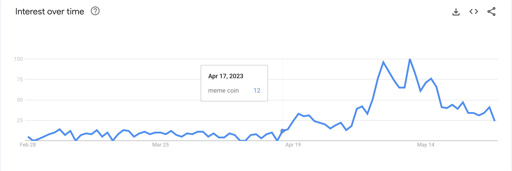

# The Rise of Meme on Uniswap V3

As of Jun 4, 2023, there are 856 meme coins listed on [Coinmarketcap](https://coinmarketcap.com/view/memes/).

> What is a meme coin?
>
> -   A meme coin is a cryptocurrency that doesn't take itself as seriously as leading digital currencies like Bitcoin and Ethereum. Dogecoin (DOGE) - widely regarded as the first meme cryptocurrency.
>
> -   A meme coin doesn't need to have a purpose that is as closely tied to their underlying value, like Bitcoin and Ethereum. A meme coin often seems to have the sole purpose of "going to the moon," a phrase popularized by Dogecoin's skyrocketing price in early 2021.

Started on Apr 17, interest in meme coins surged.

Since Apr 17, Uniswap V3 daily volume peaked on May 6 with $1.2B. And by Jun 4, the aggregate volume is $31B.

<iframe src="https://dune.com/embeds/2558147/4226177" width="800" height="400"></iframe>

*Top 5 coins with the most TVL are WETH, USDC, USDT, WBTC, and DAI. Pools which consist of 2 in these coins are also top pools with the most trading volume. I call these pools major pools.*

Of $31B, 12 major pools account for 76%, despite only account for 0.3% in total # pool.

<iframe src="https://dune.com/embeds/2558904/4227913" width="800" height="400"></iframe>

There are more than 4k pools in the minor pools group. The pools of meme coins are in this group.

<iframe src="https://dune.com/embeds/2558904/4295895" width="800" height="400"></iframe>

*Pools in the minor group are mostly pairs of a minor coin with a major coin. Let's breakdown volume of minor pools from the angle of swap from or to a minor coin to have a better sense of minor coins share in total minor pools volume.*

Volume from and to PEPE is almost 1/4 of total minor pools volume.

<iframe src="https://dune.com/embeds/2593947/4297399" width="800" height="400"></iframe>

From another angle, as PEPE led the rise of meme, almost 60% of minor pools volume is from and to minor coins which are PEPE or created after PEPE. These coins are likely meme coins.

<iframe src="https://dune.com/embeds/2593947/4303483" width="800" height="400"></iframe>

When zoom into the group of PEPE or created after PEPE coins, which has 1420 coins, top 10 coins account for more than 80% of total volume.

<iframe src="https://dune.com/embeds/2598408/4306995" width="800" height="400"></iframe>

With a quick check on etherscan.io, all of the coins in top 10 are meme coins. Without checking all of them, my assumption is all of these 1420 coins are all meme coins.

<iframe src="https://dune.com/embeds/2598408/4310278" width="800" height="500"></iframe>

At its peak, meme pools acounted for 21% in total trading volume per day, more than half of total # trader per day, and total # trade per day on Uniswap V3.

<iframe src="https://dune.com/embeds/2492014/4099854" width="800" height="400"></iframe>

<iframe src="https://dune.com/embeds/2492014/4099858" width="800" height="400"></iframe>

<iframe src="https://dune.com/embeds/2492014/4102957" width="800" height="400"></iframe>

Now meme coins are identified, let's dive into the effect of the rise of meme on Uniswap V3 trading activity on Ethereum.

# Key Highlights

Meme have attracted new users to Uniswap.

-   At its peak, meme coins accounted for 3/4 of new trader per day. New trader share in meme pools was also higher than that in other pools.

-   By cohort, meme traders also return to Uniswap V3 more than average traders. When meme traders return, they return for not only the meme coins but also for the major coins.

-   And almost half of new mem traders are also new to Ethereum.

Most active meme traders are young, most profitable traders are older. Whale traders have played important role in the rise of meme.

-   Meme traders can be very young (0 weeks old), or very old (108 weeks old). Generally, the older a trader, the less active the trader is. The most active meme traders are 6 weeks old or less. However, the most profitable traders are 17 weeks old or more. Experience, not activeness, dictates a meme trader's profitability. The more volume they trade, the less return they yield.

-   Whale & blue whale traders only account for 0.2% of total # traders, but account for 52% of total volume. And they achieve such high volume not by having big volume in one trade but by having high frequency in trading.

-   Meme traders generated the most profit from trading PEPE. While they yield the most per investment unit (i.e. profit margin) from trading PEEPO.

Pools of meme coins have been a big part of new pool created on Uniswap.

-   Number of pool created on Uniswap V3 increased during the rise of meme. And meme pools account for at least 70% of new pool created per day.

-   Meme coins are mostly paired with WETH. Meme coins also paired with other meme coins. For every 2 pools where base coins are meme, another pool created where quoted token is meme.

Overall, other pools which don't consist of meme coins appears to gain more than loss in the rise of meme.

-   The rise of meme had no clear adverse effects on other pools trading activities. Quite the opposite, trading activities in other pools increased and decreased with meme pools.

-   On the other hand, # LPs in other pools and meme pools were highly correlated in a negative way. When one rise, the other fall. That said, liquidity in other pools saw mix correlation with liquidity in meme pools. In aggregate, other pools saw net liquidity decrease while meme pools saw net liquidity increase from Apr 17 to Jun 4.

The rise of meme have onboarded more than 180k Defi users to Ethereum in total. And most of them were onboarded to Uniswap.

# The Meme Effects on Uniswap V3

## New Trader

Total new trader was highly correlated to new meme trader. As the share of new meme trader increased, total new trader increased. The situation was the same on the way down. During the period, meme pools have accounted for at least 54% of total new trader per day. At its peak, on May 5, meme pools accounted for 3/4 of total new trader per day on Uniswap V3.

<iframe src="https://dune.com/embeds/2493899/4103138" width="800" height="400"></iframe>

In a few days that trading activity of meme coins surged, new trader share in meme pools rose higher than that in other pools, the largest difference was almost 3x (31% vs. 11% on May 5).

<iframe src="https://dune.com/embeds/2493956/4103153" width="800" height="400"></iframe>

Thus, it is safe to say that the rise of meme did attract new trader to Uniswap V3.

However, it raised another question 👇.

### How sticky are these meme traders?

*I use retention rate to measure traders stickiness. Retention rate is % of a trader cohort return (to swap on Uniswap).*

Retention rate of meme traders in the first 3 weeks is at least 1.5x retention rate of average traders. From week 4th, the former appears to drop faster than the latter. However, in the first 6 weeks, meme traders' retention rate are still higher than that of average traders on Uniswap V3.

<iframe src="https://dune.com/embeds/2496227/4107513" width="800" height="400"></iframe>

### When they returned, what did they return for?

When meme traders returned, almost 90% of their acitivities were in the meme pools. And those activity only accounted for 60% in their total return volume.

<iframe src="https://dune.com/embeds/2496472/4107727" width="800" height="400"></iframe>

<iframe src="https://dune.com/embeds/2496472/4107714" width="800" height="400"></iframe>

Of 40% in total return volume which was not in meme pools, 3/4 was in pools consist of 2 in 3 most popular coins: USDC, USDT, and WETH.

<iframe src="https://dune.com/embeds/2499183/4112381" width="800" height="400"></iframe>

### How old are these new meme trader on Ethereum?

These new meme trader on Uniswap V3 have Ethereum ages range from 0 to 372 weeks old. And almost half of them are also new to Ethereum (i.e trade meme coins on Uniswap V3 within the first week on Ethereum).

<iframe src="https://dune.com/embeds/2608267/4334925" width="800" height="400"></iframe>

Next, let's examine activity of traders in the meme pools.

## Trader of Meme

Looking at meme trading activity on Uniswap V3 by volume bucket, we can see that most of volume is in the buckets > $100K per trader. Meanwhile, most of trader is in the buckets < $1k per trader.

<iframe src="https://dune.com/embeds/2506268/4124293" width="800" height="400"></iframe>

To get better insights, let's break them down further.

*I use [IQR](https://en.wikipedia.org/wiki/Interquartile_range#Outliers) to group and find outliers. The result is meme traders grouped by trader types, separated by volume range, with summary table below.*

<iframe src="https://dune.com/embeds/2506179/4124159" width="800" height="300"></iframe>

There are 265k retail traders, account for 85% of total # trader, with $220M in total volume, this is only $60M higher than volume of the biggest meme trader, more on that later.

Meanwhile, there are 708 whale & blue whale traders, with $2.8B in total volume, this is more than the other 3 trader types combined.

<iframe src="https://dune.com/embeds/2506219/4124207" width="800" height="400"></iframe>

<iframe src="https://dune.com/embeds/2506219/4332266" width="800" height="400"></iframe>

### Retail, Degen, & Chad Trader

#### Volume & Age

Trader's volume & age of 3 trader groups: retail, degen, & chad are quite similar to one another. The most active traders cluster is 6 weeks old or less.

Additionally, the 20-70 weeks old traders are noticably less active than the others in term of both volume and # traders, especially in the high volume cluster of each group. These traders were onboarded from around Jan 2022 to Jan 2023, when crypto market was on the way down.

:::{.column-page-right}

<iframe src="https://dune.com/embeds/2503542/4119790" width="1200" height="400"></iframe>

<iframe src="https://dune.com/embeds/2504108/4120334" width="1200" height="400"></iframe>

<iframe src="https://dune.com/embeds/2506417/4124489" width="1200" height="400"></iframe>

:::

#### Behavior

Between degen and retail, what set degen apart from retail are both trade size (i.e. volume per trade) and trade frequency (i.e. # trade per week).

<iframe src="https://dune.com/embeds/2522991/4154944" width="800" height="400"></iframe>

However, between chad and degen, trade size has a more important role than trade frequency in what set chad apart from degen.

<iframe src="https://dune.com/embeds/2604314/4317068" width="800" height="400"></iframe>

### Whale & Blue Whale Trader

#### Volume & Age

While whale traders have volume range of $876K - $5m, age range of 0 - 108 weeks old, the most active cluster has $1m - $2m in volume, and is 2 - 6 weeks old.

<iframe src="https://dune.com/embeds/2506062/4123884" width="800" height="400"></iframe>

Blue whale **0xd985c35f566c9de55df16ade36852b0c40f4bf59** is 5 weeks old, has $156M in total volume, and is the biggest meme trader on Uniswap V3.

The most active cluster is 67 weeks old with 11 blue whales. Following by the 40 weeks old cluster with 8 blue whales. Unlike the trader types above, blue whales are more evenly distributed along the age spectrum.

Generally, the older a blue whale is the less volume traded.

<iframe src="https://dune.com/embeds/2506075/4123915" width="800" height="400"></iframe>

#### Behavior

On average, blue whales' trade size are bigger than that of whales. However, what set blue whales apart from whales is trade frequency. Top blue whales stand out by having trade frequency much higher than average.

<iframe src="https://dune.com/embeds/2522234/4153461" width="800" height="400"></iframe>

A quick check on etherscan shows that these traders are actually bots which have a lot of MEV transactions.

<iframe src="https://dune.com/embeds/2506075/4330069" width="800" height="400"></iframe>

Next, let's examine blue whale traders profit to understand more about the top traders performance.

#### Blue Whale Profit

*I only consider blue whales who had bought and sold meme coins and realized profit.*

Not all blue whales are profitble trading meme. Their realized profit vary from - $1.5M to $2m, and margin vary from -16% to 36%. The most profitable trader is not in top 5 volume. And top 5 volume traders' profits are less than $1m each, with margin of 8% or less.

<iframe src="https://dune.com/embeds/2611487/4333863" width="800" height="400"></iframe>

None of top 10 profitable blue whale traders are new (6 weeks old or less). They are at least 17 weeks old. Most of them are not in top traders with most trade size or most trade frequency. A half of them have 2 digits % profit margin, the other half have 1 digit % profit margin (mostly 1% - 2%). Top profitable traders may not have the same trading strategies, however they are all experienced traders.

:::{.column-page-right}

<iframe src="https://dune.com/embeds/2611487/4334049" width="1200" height="400"></iframe>

:::

PEPE generates the most profit to traders with $3m, while blue whale traders yield the most profit per investment from trading PEEPO. Blue whale traders realized $79 profit from $100 investment in PEEPO.

<iframe src="https://dune.com/embeds/2612535/4334264" width="800" height="400"></iframe>

Only top 10 meme coins in term profit generate more than $100K in total profit each, and they all rank low in profit margin. This is quite predictable as most of them are top trading volume coins which deminish the profit margin.

:::{.column-page-right}

<iframe src="https://dune.com/embeds/2612535/4333816" width="1200" height="400"></iframe>

:::

## New Trading Pool

Number of pool created per day on Uniswap V3 was up from Apr 17 to May 24 then down till Jun 4. During the period, pools of meme coins accounted for at least 70% most of the time, peaked at 97% on May 7.

<iframe src="https://dune.com/embeds/2600589/4310636" width="800" height="400"></iframe>

Of 1847 new pools created, 1577 pools are of meme coins.

<iframe src="https://dune.com/embeds/2600589/4310648" width="800" height="400"></iframe>

### Meme Pool Breakdown

Meme coins are mostly paired with WETH. WETH has 359 pools where it is the base token (token0 - the first category), and 1k pools where it is the quoted token (token1 - the second category). In both categories, WETH leads with a large margin vs. the followings coins.

Surprisingly, PEPE is no.3 base token, not no.2. BURN is no.2 despite not in top 10 trading volume of meme coins.

<iframe src="https://dune.com/embeds/2606107/4320716" width="800" height="400"></iframe>

Top 3 quoted coins are all major coins. PEPE is no.5, again trailing to BURN at no.4.

<iframe src="https://dune.com/embeds/2606271/4320726" width="800" height="400"></iframe>

Another observation here about the ratio of # base pool / # quoted pool is that, on one hand, except for WETH's ratio, which is around 1/3, the other major coins' ratios are around 1/2. On the other hand, meme coins (at least with the top ones) have an opposite ratio, which is around 2.

In other words, for every 2 pools created where base coins are meme, another pool created where quoted token is meme. And for every 2-3 pools created where quoted coins are WETH or USDC, another pool created where base token is one of them.

## Other Pool (i.e. not meme pool)

Though trading activity in other pools have been down. There was no clear adverse effects of meme pools on other pools. We even saw favorite effects as we learned [above](https://lequangphu.github.io/blog/posts/uniswap-memecoin-mania/#when-they-returned-what-did-they-return-for) that meme coins attracted new traders to Uniswap V3 and when they returned, they also traded in other pools.

As trading activity (volume, # trader, # trade) in meme pools surged, trading activity in other pools also surged. And in those surges, other pools' peaks lagged those of meme pools 1 day (as seen on May 5 and May 23). This could be resulted from meme traders exitting their meme position to major coins.

<iframe src="https://dune.com/embeds/2492014/4310887" width="800" height="400"></iframe>

<iframe src="https://dune.com/embeds/2492014/4310900" width="800" height="400"></iframe>

<iframe src="https://dune.com/embeds/2492014/4310908" width="800" height="400"></iframe>

About liquidity, if only consider liquidity providers (LPs) actions during the period, tvl of meme pools and other pools saw correlation changed overtime. In one period, they increased together, in other period, one rose while the other fell.

<iframe src="https://dune.com/embeds/2606323/4320939" width="800" height="400"></iframe>

The negative correlation between meme pools and other pools is easier to observe in # LPs. From Apr 17 to May 1, while the number was increasing in meme pools, it was decreasing in other pools. After that, the trends reversed.

<iframe src="https://dune.com/embeds/2606323/4323329" width="800" height="400"></iframe>

### LPs Overlap

8% of LPs in other pools provide liquidity in meme pools. It's a small share, however, in aggregate, they have - $1.81B in net tvl, while the rest have $1.76B in net tvl. In other words, 8% of LPs have reduced more tvl than 92% of LPs increased tvl in the same period.

→ LPs in other pools who also provide liquidity to meme pools played a major role in other pools liquidity.

<iframe src="https://dune.com/embeds/2607844/4323558" width="800" height="400"></iframe>

<iframe src="https://dune.com/embeds/2607844/4323561" width="800" height="400"></iframe>

Those overlap LPs account for 22% in total LPs of meme pools. Interestingly, they have also been net decrease tvl in meme pools, however the amount is much smaller with - $29M.

<iframe src="https://dune.com/embeds/2607915/4323573" width="800" height="400"></iframe>

<iframe src="https://dune.com/embeds/2607915/4323572" width="800" height="400"></iframe>

# The Meme Effects on Ethereum

We have learned above that new meme traders on Uniswap V3 are also new to Ethereum. But exactly how many Defi users have meme coins onboarded to Ethereum?

From Apr 17 to Jun 4, meme coins have onboarded at least 2k Defi users per day to Ethereum. In aggregate, meme coins have onboarded 180k Defi users to Ethereum.

<iframe src="https://dune.com/embeds/2608394/4324900" width="800" height="400"></iframe>

And most of them were onboarded to Uniswap.

<iframe src="https://dune.com/embeds/2608657/4329399" width="800" height="600"></iframe>

# Conclusion

Even though meme is for fun, the rise of it recently has had a great impact on Uniswap, especially in onboarding new users. New and inexperienced traders are majority in total # meme traders. However, the main driver of total trading volume and yield most of profit in the rise of meme are very large traders, most of them are experienced and use bot to trade meme coins.