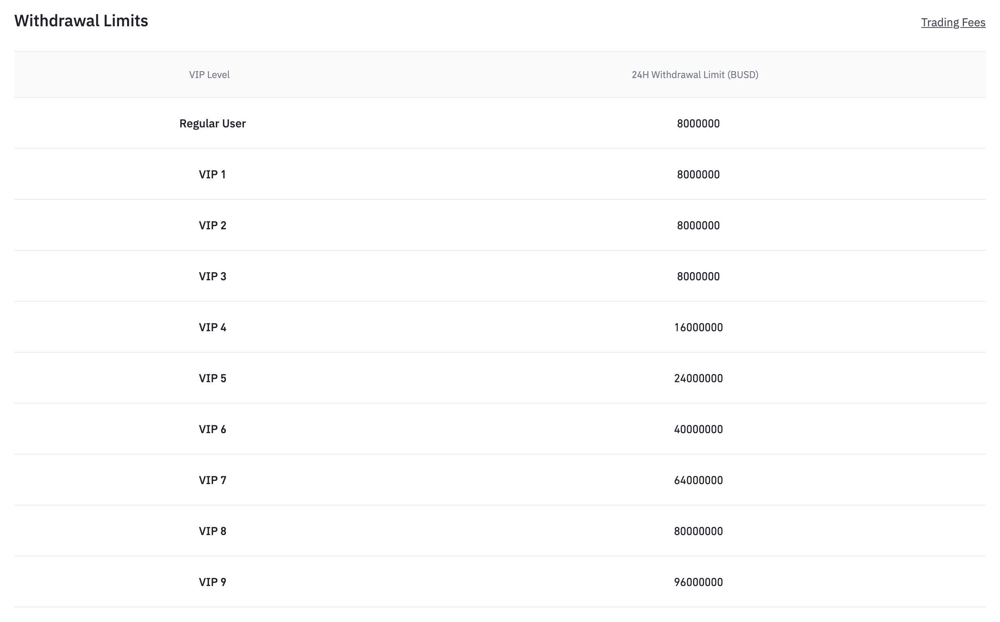
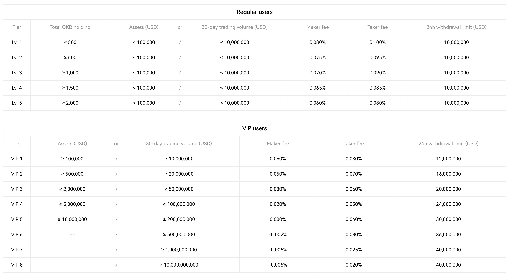

The crypto exchange battle involves two parts: Liquidity and Trade. Liquidity is necessary for trading, making it the first half of the competition. This post will focus on that first half, specifically, I'll examine Uniswap and top centralized exchanges (CEX) to better understand the competition.

First, let's take a quick look back at some important events in the history of crypto exchanges.

-   On Jan 3, 2009, Satoshi Nakamoto mined the first block of Bitcoin.

-   One year later, on Mar 17, 2010, Bitcoinmarket.com, the first crypto exchange went live. [link](https://www.cryptohopper.com/blog/what-was-the-first-crypto-exchange-449)

-   Four months later, on Jul 18, 2010, mtgox.com, the famous defunct exchange, launched. By Apr 2013, and into early 2014, it became the largest Bitcoin exchange, handling over 70% of total Bitcoin trades. On Feb 28, 2014, after a series of major security breaches, and bitcoin stolens, the exchange filed for bankruptcy. [link](https://en.wikipedia.org/wiki/Mt._Gox)

-   Meanwhile, in Jun 2012, Brian Amstrong founded Coinbase, the current largest CEX in the US. [link](https://en.wikipedia.org/wiki/Coinbase)

-   Six months later, Bitfinex was founded. [link](https://en.wikipedia.org/wiki/Bitfinex)

-   Five years after the launch of Coinbase, on Jul 14, 2017, Changpeng Zhao founded Binance, the current largest crypto exchange in the world. [link](https://en.wikipedia.org/wiki/Binance)

-   In the same year, OKX was launched. [link](https://en.wikipedia.org/wiki/OKX)

-   Over a year later, on Nov 2, 2018, Hayden Adams founded Uniswap, the first, and also the current largest decentralized exchange (DEX) in the world. [link](https://en.wikipedia.org/wiki/Uniswap)

It's been 14 years since the Bitcoin's genesis block mined, 13 years since the first CEX founded, and almost 5 years since the first DEX founded. Before progressing to the end of this post, some data points to take note:

-   DEX is 8 years younger than CEX.

-   Uniswap is 6 years younger than Coinbase, Bitfinex, and 1 years younger than Binance, OKX.

::: callout-tip
## How to read charts

-   Charts from theblockcrypto.com has default zoom of the last 12 months. There are other options at the bottom right corner of the charts. Some comments below are of all time (ALL) or year to date (YTD) zoom option, so if you want to see related data, click the corresponding zoom option.

-   Sometimes, if a chart from theblockcrypto.com doesn't show up due to embed error, you can see the chart by clicking their source links located right below them.
:::

# DEX vs. CEX

Liquidity of an exchange, is assets available to buy and sell at a given price. (Q) But how does the exchange have the assets in the first place? (A) Assets providers must deposit the assets to the exchange. And it depends on the exchange mechanism, assets provider might directly involve in a trade, as the counterparty on the other side of the trade.

The main exchange mechanism of DEX is actually very different from that of CEX. While CEXs mainly support [Order Book](https://www.coinbase.com/learn/advanced-trading/what-is-an-order-book), DEXs mainly support [AMM](https://chain.link/education-hub/what-is-an-automated-market-maker-amm#:~:text=Automated%20market%20makers%20(AMMs)%20are%20a%20type%20of%20decentralized%20exchange,trade%20directly%20through%20the%20AMM.).

Last 12 months, out of every 100 trades on DEXs, at least 96 trade were processed using Constant Product (i.e. AMM), and Hybrid mechanisms.

<iframe width="100%" height="420" frameborder="0" src="https://embed.theblockcrypto.com/data/decentralized-finance/dex-non-custodial/dex-mechanism-volume-share/embed" title="DEX Mechanism Volume Share">

</iframe>

*source: [theblockcrypto.com](https://www.theblockcrypto.com/data/decentralized-finance/dex-non-custodial/dex-mechanism-volume-share)*

## Liquidity

*In this section, let's look at total asset deposited in DEX (i.e. TVL, value locked), and in CEX (i.e. [proof of reserves](https://www.coingecko.com/learn/what-is-proof-of-reserves-por)).*

<!-- prepare for plotly charts -->

```{python}
import requests
import pandas as pd
import plotly.express as px
import plotly.io as pio
from datetime import datetime

pd.options.mode.chained_assignment = None  # default='warn'

pio.templates.default = 'plotly_white'
```

<!-- get CEX proof of reserves -->

```{python}
r = requests.get('https://api.llama.fi/protocols')
```

```{python}
df_protocols = pd.DataFrame(r.json())
df_essential = df_protocols[['name','category','slug','tvl','parentProtocol']]
df_exchange = df_essential.query('category in ("CEX","Dexes")')

# extract the part after 'parent#' using str.extract() method
df_exchange['parentName'] = df_exchange['parentProtocol'].str.extract(r'parent#(.*)')

df_exchange['parentName'] = df_exchange['parentName'].str.capitalize()

df_exchange['parentName'] = df_exchange['parentName'].fillna(df_exchange['name'])
```

DEX total assets is roughly 15% of that on CEX, which has surpassed \$100B.

```{python}
df_cat = df_exchange[['category','tvl']].groupby(by='category', as_index=False).sum()

fig = px.bar(
    df_cat, x='category', y='tvl',
    title='Exchange Total Assets',
    text_auto='.3s'
)

fig.update_layout(
    xaxis_title='Exchange Category', 
    yaxis_title='Total Assets in USD'
)

fig.show()
```

*source: [defillama.com](https://defillama.com/docs/api)*

Defillama tracks 842 DEXs. Top 14 DEXs account for 81% of total assets on DEX, each has at least \$100M in total assets, the largest one is Uniswap with \$4B.

```{python}
df_dex = df_exchange.query('category == "Dexes"')

df_dex_agg = df_dex[['parentName', 'category', 'tvl']].groupby(by=['parentName', 'category'], as_index=False).sum()

df_dex_agg = df_dex_agg.sort_values('tvl')

df_100m = df_dex_agg[df_dex_agg['tvl'] >= 1e8]

df_rest = df_dex_agg[df_dex_agg['tvl'] < 1e8]

rest_count = df_rest['tvl'].count()

df_rest = pd.DataFrame({'parentName': [f'{rest_count} Others'], 'tvl': [df_rest['tvl'].sum()]})

df_100m_rest = pd.concat([df_rest, df_100m])

fig = px.bar(
    df_100m_rest, x='tvl', y='parentName',
    title='DEX Total Assets',
    text_auto='.2s',
    height=800
)

fig.update_layout(
    xaxis_title='Total Assets in USD', 
    yaxis_title='DEX'
)

fig.show()
```

*source: [defillama.com](https://defillama.com/docs/api)*

Defillama tracks 28 CEXs. Top 21 CEXs which have proof of reserves (POR) range between \$100M and \$60B. Top 3 CEXs account for almost 80% of total CEX assets. Binance is the largest CEX in total assets, 6 times higher than OKX, the second largest CEX.

```{python}
df_cex = df_exchange.query('category == "CEX"').sort_values('tvl')

df_100m = df_cex[df_cex['tvl'] >= 1e8]

df_rest = df_cex[df_cex['tvl'] < 1e8]

rest_count = df_rest['tvl'].count()

df_rest = pd.DataFrame({'name': [f'{rest_count} Others'], 'tvl': [df_rest['tvl'].sum()]})

df_100m_rest = pd.concat([df_rest, df_100m])

fig = px.bar(
    df_100m_rest, x='tvl', y='name',
    title='CEX Total Assets',
    text_auto='.2s',
    height=800
)

fig.update_layout(
    xaxis_title='Total Assets in USD', 
    yaxis_title='CEX'
)

fig.show()
```

*source: [defillama.com](https://defillama.com/docs/api)*

Although Defillama data about DEX and CEX might miss a few exchanges in each category, the fact that crypto market has almost 900 DEXs and almost 30 CEXs, or 30:1 DEX to CEX, and DEX is 8 years younger than CEX, is quite astounding. This implies that the entry bar to the DEX market is much lower than the entry bar to the CEX market.

In top 10 exchanges, only 2 of them are DEX, which are Uniswap, and Curve, at 4th and 5th position respectively. Their combined assets is just 13% of Binance assets.

```{python}
df_exchange_adj = pd.concat([df_cex[['parentName', 'category', 'tvl']], df_dex_agg], ignore_index=True)
n = 10
df_top_ex = df_exchange_adj.sort_values('tvl', ascending=False).head(n)
df_top_ex = df_top_ex.sort_values('tvl')

fig = px.bar(
    df_top_ex, x='tvl', y='parentName',
    title=f'Top {n} Exchange Total Assets',
    text_auto='.2s'
)

fig.update_layout(
    xaxis_title='Total Assets in USD', 
    yaxis_title='Exchange'
)

fig.show()
```

*source: [defillama.com](https://defillama.com/docs/api)*

Binance is leading the crypto exchange market with a huge gap vs. the followings, both in total assets as seen above, and trade volume in the next section. And with that gap, it seems that the crypto exchange battle in CEX category is settled, while that battle in DEX category is more interesting to observe.

## Trade

*In this section, to compare DEX to CEX, let's look at DEX to CEX spot volume, which is monthly decentralized exchange volume divided by centralized exchange volume (as a percentage).*

One and a half year after the first data point in Jan 2019, DEX to CEX spot volume first surpassed 1% in Jun 2020. Four months later, DEX to CEX spot volume skyrocketed to 16% in Sep 2020. Sixteen months later, it made a higher high to 17% in Jan 2022. And recently, in May 2023, it made all-time high at 22%. That marked DEX spot volume surpassed a fifth of that on CEX.

In the first half (H1) of 2023, the DEX to CEX spot volume grew from 9.6% to 16.8%. This could be driven by the colapse of FTX, and recent legal crack downs on CEXs around the world.

Combine with DEX to CEX spot volume of roughly 15%, we can see that, from \$1 of assets, DEX is on the trend of generating a higher \$volume than CEX.

<iframe width="100%" height="420" frameborder="0" src="https://embed.theblockcrypto.com/data/decentralized-finance/dex-non-custodial/dex-to-cex-spot-trade-volume/embed" title="DEX to CEX Spot Trade Volume (%)">

</iframe>

*source: [theblockcrypto.com](https://www.theblockcrypto.com/data/decentralized-finance/dex-non-custodial/dex-to-cex-spot-trade-volume)*

In absolute \$, spot volume of DEX and CEX's all-time high are \$213b and \$4.25t, both recorded in May 2021, which translates to 9% of DEX to CEX spot volume.

Last 12 months, though both spot volume on DEX and CEX have generally been down, DEX to CEX spot volume (as seen above) has been up, which implies a slower drop in DEX spot volume.

<iframe width="100%" height="420" frameborder="0" src="https://embed.theblockcrypto.com/data/decentralized-finance/dex-non-custodial/dex-volume-monthly/embed" title="DEX Volume">

</iframe>

*source: [theblockcrypto.com](https://www.theblockcrypto.com/data/decentralized-finance/dex-non-custodial/dex-volume-monthly)*

<iframe width="100%" height="420" frameborder="0" src="https://embed.theblockcrypto.com/data/crypto-markets/spot/cryptocurrency-exchange-volume-monthly/embed" title="Cryptocurrency Monthly Exchange Volume">

</iframe>

*source: [theblockcrypto.com](https://www.theblockcrypto.com/data/crypto-markets/spot/cryptocurrency-exchange-volume-monthly)*

# Uniswap vs. Top CEXs

*In this section, depends on data availability, I will compare Uniswap to at least 1 CEX among Binance, OKX, Bitfinex, and Coinbase.*

## Liquidity

```{python}
df_top3_cex = df_exchange.query('category == "CEX"').sort_values('tvl', ascending=False).head(3)
top3_cexs = df_top3_cex['parentName'].unique().tolist()
df_uniswap = df_dex.query('parentName == "Uniswap"')
df_combine = pd.concat([df_uniswap, df_top3_cex], ignore_index=True)

df_combine['defillamaApiUrl'] = df_combine['slug'].apply(lambda x: f'https://api.llama.fi/protocol/{x}')
df_combine['apiResponse'] = df_combine['defillamaApiUrl'].apply(lambda x: requests.get(x))
df_combine['responseJson'] = df_combine['apiResponse'].apply(lambda x: x.json())
df_combine['responseLastModified'] = df_combine['apiResponse'].apply(lambda x: x.headers['Last-Modified'])

for key in ['tvl', 'currentChainTvls', 'tokensInUsd']:
    df_combine[key] = df_combine['responseJson'].apply(lambda x: x[key])
```

### Current Assets Breakdown

First, let's break down assets by chain, then by token to understand more about these exchanges total assets.

#### Chain Breakdown

```{python}
df_currentChainTvls = df_combine[['parentName', 'name', 'currentChainTvls']]

dfs = []
exs = 'Uniswap', *top3_cexs

for df, ex in zip([pd.DataFrame()]*4, exs):
    df = df_currentChainTvls[df_currentChainTvls['parentName'] == ex].reset_index(drop=True)
    df_concat = pd.concat(df['currentChainTvls'].apply(pd.json_normalize).tolist(), ignore_index=True)
    
    df = pd.concat([df[['parentName']], df_concat], axis=1)
    df = df.melt(id_vars=['parentName'], value_vars=list(df_concat.columns), var_name='chain', value_name='tvl')
    df.dropna(subset='tvl', inplace=True)
    df = df[['parentName', 'chain', 'tvl']].groupby(by=['parentName', 'chain'], as_index=False).sum()
    
    if ex != 'Uniswap':
        df_above = df[df['tvl'] / df['tvl'].sum() >= 0.01]
        df_rest = df[df['tvl'] / df['tvl'].sum() < 0.01]
        rest_count = df_rest['tvl'].count()
        df_rest = pd.DataFrame({'parentName': [ex], 'chain': [f'{rest_count} Others'], 'tvl': [df_rest['tvl'].sum()]})
        df = pd.concat([df_above, df_rest], ignore_index=True)
    
    df.rename(columns={'parentName': 'exchange'}, inplace=True)
    dfs.append(df)

df_uniswap, *df_cexs = dfs
```

All Uniswap assets are on EVM compatible chains (EVMs). Of \$100 assets, almost \$90 on Ethereum, \$7 on Arbitrum, \$2 on Polygon, \$1 or less on each of Optimism, BNB, and Celo.

```{python}
fig = px.pie(
    df_uniswap, names='chain', values='tvl', title='Uniswap Assets by Chain',
    hover_data={'tvl': ':.3s'}
)

fig.show()
```

*source: [defillama.com](https://defillama.com/docs/api)*

Meanwhile, on CEXs:

-   Binance assets are more evenly distributed among 4 chains: Bitcoin, Ethereum, Tron, and BNB, which account for roughly 90% of total assets. The other 10% is allocated among 10 other chains.

-   On OKX and Bitfinex, assets on Bitcoin and Ethereum dominate heavily, account between 95% and 98% in total assets.

```{python}
#| column: screen-inset
fig = px.pie(
    pd.concat(df_cexs, ignore_index=True), names='chain', values='tvl', title='CEX Assets by Chain',
    facet_col='exchange',
    hover_data={'tvl': ':.3s'}
)

fig.show()
```

*source: [defillama.com](https://defillama.com/docs/api)*

Next, let's breakdown the exchanges assets by token.

#### Token Breakdown

```{python}
df_tokens = df_combine[['name', 'tokensInUsd']]

dfs = []
exs = 'Uniswap V3', *top3_cexs

for df, ex in zip([pd.DataFrame()]*4, exs):
    df = df_tokens[df_tokens['name'] == ex].reset_index(drop=True)
    df_concat = pd.concat(df['tokensInUsd'].apply(lambda x: pd.json_normalize(x, max_level=0)).tolist(), ignore_index=True)
    df_concat['date'] = pd.to_datetime(df_concat['date'], unit='s')

    df = df_concat.tail(1)
    df = pd.json_normalize(df['tokens'])
    df = df.melt(value_vars=list(df.columns), var_name='token', value_name='tvl')
    
    if ex != 'Uniswap V3':
        df_above = df[df['tvl'] / df['tvl'].sum() >= 0.01]
        df_rest = df[df['tvl'] / df['tvl'].sum() < 0.01]
        rest_count = df_rest['tvl'].count()
        df_rest = pd.DataFrame({'token': [f'{rest_count} Others'], 'tvl': [df_rest['tvl'].sum()]})
        df = pd.concat([df_above, df_rest], ignore_index=True)
    
    df['exchange'] = ex
    dfs.append(df)

df_uniswap_v3, *df_cexs = dfs
```

```{python}
# with open('/Users/phu/lequangphu.github.io/.secrets/dune_api_key.txt') as f:
#     api_key = f.read()
# r = requests.get(f'https://api.dune.com/api/v1/query/2685347/results?api_key={api_key}')

r = requests.get(f'https://api.dune.com/api/v1/query/2685347/results?api_key=5xBKE5jaoCbLPUrFMydFVYokznFX1GP6')
```

```{python}
df_uniswap_v1n2 = pd.json_normalize(r.json()['result']['rows'])
df_uniswap_v1n2 = df_uniswap_v1n2[['token', 'tvl']]
```

```{python}
df_uniswap = pd.concat([df_uniswap_v1n2, df_uniswap_v3[['token', 'tvl']]], ignore_index=True)
df = df_uniswap.groupby(by='token', as_index=False).sum()

df_above = df[df['tvl'] / df['tvl'].sum() >= 0.01]
df_rest = df[df['tvl'] / df['tvl'].sum() < 0.01]
rest_count = df_rest['tvl'].count()
df_rest = pd.DataFrame({'token': [f'{rest_count} Others'], 'tvl': [df_rest['tvl'].sum()]})
df_uniswap = pd.concat([df_above, df_rest], ignore_index=True)
```

Uniswap assets allocate in more than 2k tokens. Of \$100 assets, \$80 in top 9 tokens, of which almost \$40 in WETH, \$25 in stablecoins (USDC, USDT, DAI, and FRAX), almost \$4 in WBTC.

```{python}
fig = px.pie(
    df_uniswap, names='token', values='tvl', title='Uniswap Assets by Token',
    hover_data={'tvl': ':.3s'}
)

fig.show()
```

*source: [defillama.com](https://defillama.com/docs/api)*

Mean while, CEX assets are less diversified in number of tokens (less than 100).

-   On Binance, of \$100 assets, about \$60 roughly equally shared between BTC and USDT, \$14 in BNB, \$11 in WETH.

-   On OKX, of \$100 assets, \$96 in top 3 tokens: USDT, BTC, and WETH.

-   Similarly, on Bitfinex, of \$100 assets, \$97 in top 3 tokens: BTC, WETH, and [LEO](https://coinmarketcap.com/vi/currencies/unus-sed-leo/) (exchange token of Bitfinex). If you haven't heard of LEO, you are not alone 🤣.

```{python}
#| column: screen-inset
fig = px.pie(
    pd.concat(df_cexs, ignore_index=True), names='token', values='tvl', title='CEX Assets by Token',
    facet_col='exchange',
    hover_data={'tvl': ':.3s'}
)

fig.show()
```

*source: [defillama.com](https://defillama.com/docs/api)*

In absolute \$, assets in WETH on Uniswap is at the level of OKX and Bitfinex (\$1B-\$2B), and a fourth of that on Binance.

In percentage of total assets, WETH and stablecoins have the opposite position. On one hand, assets in WETH on Uniswap is higher than all of those on the 3 CEXs. On the other hand, Binance and OKX allocate more share to stablecoins, 25% to double that of Uniswap. Surprisingly, on Bitfinex, stablecoins have less than 1% of total assets.

Next, let's examine the trend of total assets in H1 2023.

### Assets in H1 2023

```{python}
df_tvl = df_combine[['parentName', 'name', 'tvl']]

dfs = []
exs = 'Uniswap', *top3_cexs

for df, ex in zip([pd.DataFrame()]*4, exs):
    df = df_tvl[df_tvl['parentName'] == ex]
    df = pd.concat(df['tvl'].apply(pd.json_normalize).tolist(), ignore_index=True)
    df['date'] = pd.to_datetime(df['date'], unit='s')
    df = df.groupby(by='date', as_index=False).sum()
    df.sort_values('date', inplace=True)
    df['Exchange'] = ex
    dfs.append(df)
```

In H1 2023, on Uniswap:

-   Total assets grew 25% from \$3.2B to \$4B. It ranged between \$2.8B and \$4.4B, or max 12% down, and 38% up.

Meanwhile, on CEXs:

-   Binance total assets grew 7% from \$54B to \$58B. It ranged between \$54B and \$71B (i.e. max 31% up).

-   OKX total assets grew 60% from \$6.4B to \$10.3B. The start is also the trough, and the end is also roughly the peak, imply a strong uptrend.

-   Bitfinex total assets grew 57% from \$6.3B to \$9.9B.

```{python}
df_concat = pd.concat(dfs, ignore_index=True)
df_concat = df_concat[
    (df_concat['date'] >= '2023-01-01') & (df_concat['date'] <= '2023-06-30')
]

df_concat.rename(columns={'date': 'Date', 'totalLiquidityUSD': 'Total Assets in USD'}, inplace=True)

fig = px.line(
    df_concat, x='Date', y='Total Assets in USD', title='Total Assets H1 2023',
    facet_row='Exchange',
    height=800
)

fig.update_yaxes(matches=None)

fig.show()
```

*source: [defillama.com](https://defillama.com/docs/api)*

In H1 2023, Uniswap assets growth is more than triple faster than that of Binance, however, it is less than half of OKX and Bitfinex assets growths.

Next, since (1) Uniswap only supports EVMs, and (2) EVMs onchain data is more widely supported by analytics platforms such as Dune, let's dive into EVMs onchain data to understand more about assets flow and assets provider behavior in H1 2023.

## EVM Liquidity

First, let's compare assets flow in/out of the exchanges to see if we can extract any insights.

### Assets Flow

#### In/Out

*Note: Total assets moved = total assets added + total assets removed*

In H1 2023, on Uniswap:

-   Assets providers moved between \$250M (on May 4) and \$15.7B (on January 12) assets in total per day. Total assets moved per day is mostly below \$6B.

-   And the providers are noticably more active in the first quarter (Q1) than in the second quarter (Q2). One possible reason is APY of Uniswap pools were higher in Q1 than that in Q2, as seen in the Uniswap Median APY chart below.

<iframe src="https://dune.com/embeds/2688626/4471225" width="100%" height="400">

</iframe>

```{python}
r_v2 = requests.get('https://yields.llama.fi/medianProject/uniswap-v2')
r_v3 = requests.get('https://yields.llama.fi/medianProject/uniswap-v3')
```

```{python}
df_v2 = pd.DataFrame(r_v2.json()['data'])
df_v2 = df_v2[(df_v2['timestamp'] >= '2023-01-01') & (df_v2['timestamp'] < '2023-07-01')]
df_v2['version'] = 'Uniswap V2'

df_v3 = pd.DataFrame(r_v3.json()['data'])
df_v3 = df_v3[(df_v3['timestamp'] >= '2023-01-01') & (df_v3['timestamp'] < '2023-07-01')]
df_v3['version'] = 'Uniswap V3'

df_concat = pd.concat([df_v2, df_v3], ignore_index=True)
df_concat.rename(columns={'timestamp': 'Day', 'medianAPY': 'Median APY'}, inplace=True)
```

```{python}
fig = px.line(
    df_concat, x='Day', y='Median APY', title='Uniswap Median APY (%)',
    facet_row='version',
    hover_data={'Median APY': ':.3s'}
)

fig.update_yaxes(matches=None)

fig.show()
```

*source: [defillama.com](https://defillama.com/docs/api)*

Meanwhile, on CEXs:

-   Binance assets providers moved \$6B (on February 13) or less assets per day. Total assets moved per day is mostly below \$2B. The providers are noticably more active between the second half of February and the first half of March.

<iframe src="https://dune.com/embeds/2688646/4471396" width="100%" height="400">

</iframe>

-   OKX assets providers moved \$1.7B (on March 11) or less assets per day. Total assets moved per day is mostly below \$300M. The providers are noticably more active between the second and fourth week of March.

<iframe src="https://dune.com/embeds/2688727/4471409" width="100%" height="400">

</iframe>

-   Bitfinex assets providers moved \$622M (on March 24) or less assets per day. Total assets moved per day is mostly below \$200M. The providers are noticably more active in March and June.

<iframe src="https://dune.com/embeds/2688747/4471448" width="100%" height="400">

</iframe>

One common thing among all 4 exchanges is, during the stablecoins depeg event in March, they all saw surges in assets added and removed.

Have you noticed that, in H1 2023, the range of total assets moved per day on Uniswap was much larger than those on the CEXs, especially relative to total assets? With this data point, one may conclude that total assets on Uniswap fluctuates more wildly than those on the CEXs. However, it's not true as seen [above](https://lequangphu.github.io/blog/posts/uniswap-vs-cex/#assets-in-h1-2023), and also is demonstrated by net assets inflow in the next section. The possible reasons, in my opinion, are:

-   Uniswap assets providers usually move assets from one Uniswap pool to another (i.e. Uniswap internal movement). This could be driven by pools [APY](https://coinmarketcap.com/alexandria/glossary/annual-percentage-yield-apy).

-   Meanwhile, on CEXs, assets provider usually move assets, on the way in, to either sell and cash out to fiat, or deposit as margin to leverage trade, and on the way out, to either store in self custody wallets, or participate in Defi.

-   A caveat of storing assets on CEXs, which Uniswap and other DEXs don't have, is assets remove/withdraw suspension. It happens due to various reasons, and at different times. And one of the most common times is around FUD events, which raises questions among crypto community about user assets transparency of CEXs.

-   And finally, CEXs limit the amount of assets per withdraw depends on a user tier (i.e. VIP level), while Uniswap does not. This can be observed in the chart of assets removed per assets provider per day below.

In H1 2023, on average, an assets provider of Uniswap removed \$623K assets per day, which is 40 times higher than those removed from Binance and OKX, and more than double those removed from Bitfinex.

<iframe src="https://dune.com/embeds/2697448/4487492" width="100%" height="400">

</iframe>

CEX withdrawal limits:

-   Binance withdrawal limits range between \$8M and \$96M per user per 24 hours.



*source: [binance.com](https://www.binance.com/en/fee/vip)*

-   OKX withdrawal limits range between \$10M and \$40M per user per 24 hours.



*source: [okx.com](https://www.okx.com/fees)*

#### Net Inflow

The net assets inflow per day of Uniswap was much smaller than that of Binance, which ranged between -\$1.1B and \$1.4B, and was in a similar range (between -\$200M and \$200M) with those of OKX and Bitfinex, despite a much higher range of total assets moved.

<iframe src="https://dune.com/embeds/2688626/4471226" width="100%" height="400">

</iframe>

<iframe src="https://dune.com/embeds/2688646/4471399" width="100%" height="400">

</iframe>

<iframe src="https://dune.com/embeds/2688727/4471408" width="100%" height="400">

</iframe>

<iframe src="https://dune.com/embeds/2688747/4471447" width="100%" height="400">

</iframe>

Next, let's examine assets provider to understand more about the source of assets of the exchanges.

### Assets Provider

#### Daily Active Assets Provider

In H1 2023:

-   There is a big gap between active providers per day of Uniswap (and the other 2 CEXs) and that of Binance.

-   Binance active providers per day more than doubled from 54.7K to 123.6K. It mostly ranged between 60K and 180K, along with a few huge surges to as high as 712.5K (on May 19).

<iframe src="https://dune.com/embeds/2689017/4472367" width="100%" height="400">

</iframe>

-   Uniswap active providers per day grew 18% from 4.9K to 5.8K. However, the trend in Q2 was actually down as it grew and peaked in late March. This strongly correlates with Uniswap pools Median APY as seen [above](https://lequangphu.github.io/blog/posts/uniswap-vs-cex/#inout).

-   OKX active providers per day, on one hand, in Q1, was quite similar to that of Uniswap, on the other hand, in Q2, grew rapidly to 30.5K, roughly 6 times higher than that of Uniswap.

-   Bitfinex active providers per day was very small relative to the other exchanges, which implies that, on average, total assets of each Bitfinex assets provider are much higher than those of the other exchanges.

<iframe src="https://dune.com/embeds/2689017/4471976" width="100%" height="400">

</iframe>

Examining daily active assets provider answered the "How many?" question. Next, let's examine assets providers behavior to answer the "How good?" question.

#### Assets Provider Behavior

*To measure how active an asset provider is, I will examine total assets move (add + remove) in USD, and number of times the asset provider add or remove (assets movement) per week (i.e frequency) in H1 2023.*

In H1 2023, on average:

-   Uniswap assets providers moved \$700K per week, almost 40 times higher than those on Binance and OKX, and more than triple those on Bitfinex.

<iframe src="https://dune.com/embeds/2697448/4488724" width="100%" height="400">

</iframe>

-   Assets providers of Uniswap moved their assets 8.7 times per week, or more than once a day, which is more than 8 times higher than those on Binance and OKX, and more than triple that on Bitfinex.

<iframe src="https://dune.com/embeds/2689375/4480492" width="100%" height="400">

</iframe>

So we learned that Uniswap assets providers are much more active in managing their assets than those on the 3 CEXs both in value of assets per movement, and frequency of assets movement.

## Trade

*In this section, I will compare Uniswap trading volume to those of Binance and Coinbase.*

### Volume in H1 2023

In H1 2023:

-   There is a big gap between total trade volume per day (7-day moving average) of Uniswap (and Coinbase) and that of Binance.

-   Uniswap total trade volume per day grew 98% from \$446M to \$885M. It ranged between \$446M and \$4.4B (on March 16, during the recent stablecoins depeg event, which I covered in this [post](https://lequangphu.github.io/blog/posts/uniswap-stablecoin-depeg/)), i.e. max almost 10 times up.

-   February 9 marks the second time Uniswap surpassed Coinbase in total trade volume per day, the first time was on September 6 2020.

Meanwhile, on CEXs:

-   Binance total trade volume per day grew 27% from \$6.7B to \$8.5B. It ranged between \$5.6B (on May 22) and \$28.4B (on March 19, stablecoins depeg event), or max down 17% and max up more than fourfold.

-   Coinbase total trade volume per day has a similar range to that on Uniswap in most part of the period. However, it grew 26% from \$873M, roughly double that of Uniswap, to \$1.1B. It ranged between \$670M (on May 23, similar to Binance) and \$2.5B (on January 18). One interesting data point is, unlike Uniswap and Binance, Coinbase total trade volume per day did not make the highest high during the stablecoins depeg event. This might due to the fact that Coinbase tokens are mostly quoted in USD (instead of USDT on other CEXs).

<iframe width="100%" height="420" frameborder="0" src="https://embed.theblockcrypto.com/data/decentralized-finance/dex-non-custodial/uniswap-vs-coinbase-and-binance-trade-volume-7dma/embed" title="Uniswap vs. Coinbase and Binance Trade Volume (7DMA)">

</iframe>

*source: [theblockcrypto.com](https://www.theblockcrypto.com/data/decentralized-finance/dex-non-custodial/uniswap-vs-coinbase-and-binance-trade-volume-7dma)*

### Market Share

Last 12 months:

-   Market share of Uniswap in DEX and of Binance in CEX basically haven't changed.

-   Uniswap market share, as the largest DEX, grew 1% from 56.21% in July 2022 to 58.51% in June 2023.

<iframe width="100%" height="420" frameborder="0" src="https://embed.theblockcrypto.com/data/decentralized-finance/dex-non-custodial/share-of-dex-volume-monthly/embed" title="Share of DEX Volume">

</iframe>

*source: [theblockcrypto.com](https://www.theblockcrypto.com/data/decentralized-finance/dex-non-custodial/share-of-dex-volume-monthly)*

-   Binance market share, as the largest CEX, grew 1% from 47% in July 2022 to 48.98% in June 2023.

<iframe width="100%" height="420" frameborder="0" src="https://embed.theblockcrypto.com/data/crypto-markets/spot/the-block-legitimate-index-market-share/embed" title="Monthly Exchange Volume Market Share">

</iframe>

*source: [theblockcrypto.com](https://www.theblockcrypto.com/data/crypto-markets/spot/the-block-legitimate-index-market-share)*

## Volume / Total Assets

In June 2023, based on TVL on June 30, 2023, for every \$1 of assets, Uniswap generated \$8.7 in trade volume, which is more than double those on Binance and OKX. This implies, as an exchange, Uniswap is more effective with its assets than Binance and OKX in generating trade volume.

<iframe src="https://dune.com/embeds/2693086/4479361" width="100%" height="240">

</iframe>

*source: [theblockcrypto.com](https://www.theblockcrypto.com/data/decentralized-finance/dex-non-custodial/dex-volume-monthly), [theblockcrypto.com](https://www.theblockcrypto.com/data/crypto-markets/spot/cryptocurrency-exchange-volume-monthly), [defillama.com](https://defillama.com/docs/api)*

# Conclusion

In the battle of crypto exchange, DEX is still small compared to CEX, roughly 15% in both total assets and trading volume. However, as new crypto innovations (e.g. sharding, rollup) reduces onchain processing fee, new DEX features releases, and the ongoing global legal crack down on CEX, DEX is gaining share from CEX, clearly seen in DEX to CEX spot volume.

Zooming in to compare exchanges, Uniswap, as the largest DEX, is still very small compared to Binance, the largest CEX. As we passed the first half of 2023, for Uniswap:

-   The goods are (1) its volume has surpassed those of other top CEXs such as Coinbase, OKX, (2) it is more effective in generating volume from 1 unit of assets compared to Binance, OKX, (3) its assets providers are much more active in managing assets than those of top CEXs.

-   The challenges are (1) its assets is growing much slower compared to top CEXs such as OKX, Bitfinex, (2) its daily active assets provider is declining.

-   The opportunities are (1) growth on L2s from recent expansions to L2 EVM chains, coupled with the chains ongoing rapid growth, (2) growth on Ethereum with future upgrades from both Ethereum and Uniswap such as the upcoming Uniswap V4.