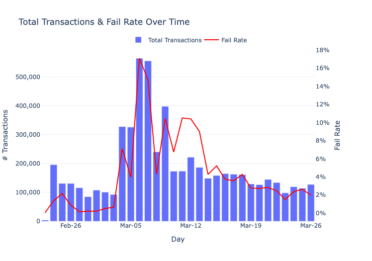
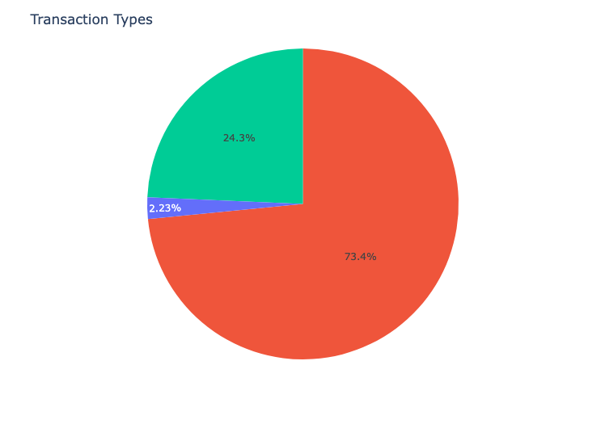
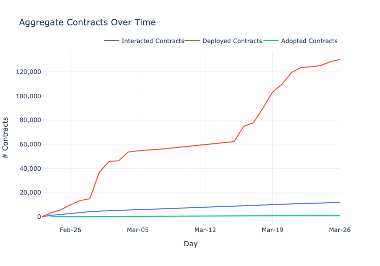
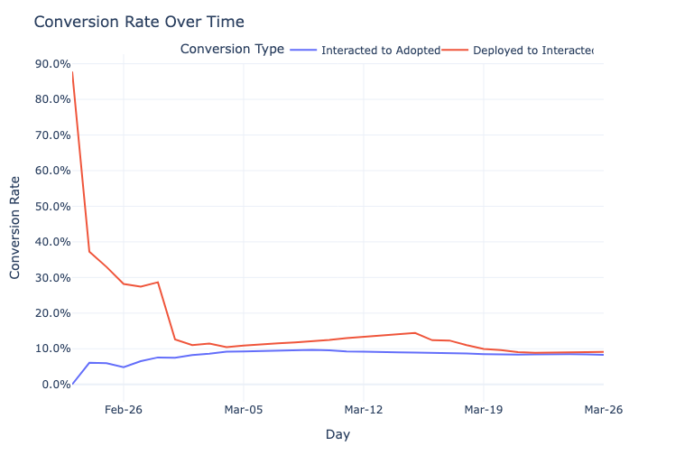
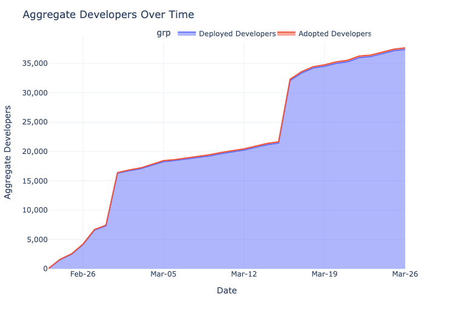
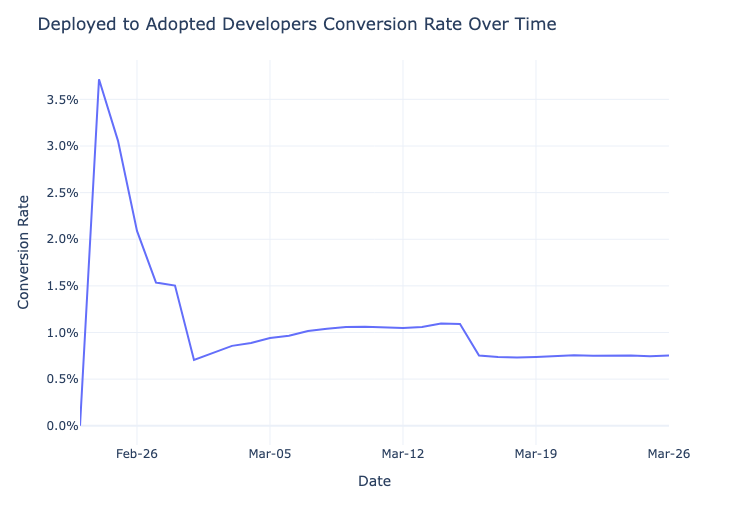
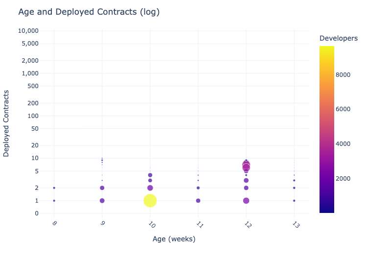
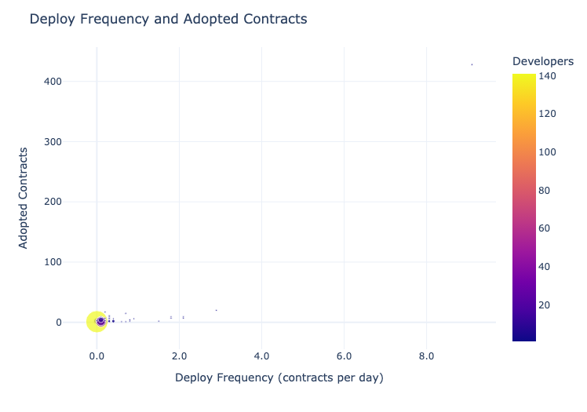
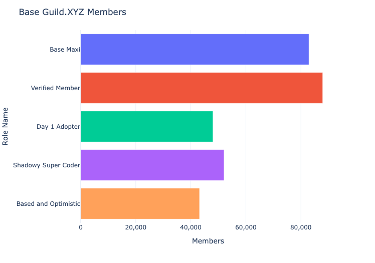

## Introduction to Base

[Base](https://base.org/) is a protocol, a smartcontract platform based on Optimism Stack. We can also view it as a marketplace which has 2 sides: supply and demand.

On the demand side are users, who use smartcontracts to achieve their goals in the decentralized world. And on the supply side are developers, who build those smartcontracts.

Growing a marketplace needs both sides to grow. It's always better to grow fast, especially in the early days like an 1-month old Base.

As you can see at the title, in this document, I will examine the supply side growth of Base. I started doing this with a question in mind: "What metrics would I want to see analyzed if I was the Base team?". The demand side is as important as the supply side, however, at the testnet phase, I think examining the supply side is more valuable.

But first, let's briefly look at Base testnet processing capacity such as transactions, fail/success rate, and success transaction by transaction type.

## Processing Capacity

Since launched on Feb 23. Base processed mostly between 100k and 200k transactions per day and fail rate mostly less than 5%, let's consider these numbers as baseline. Total transactions peaked on Mar 6 at 564k, and fail rate also peaked at 17%. Since then, both total transactions and faile rate have decreased to the baseline.

In total 5.4M success transactions: the shares are 73% normal (by contracts users), 24% system (by Base), 2% deploying contract (by developers).

A developer can deploy a contract several times on Base, each deploy is 1 transactions with unique contract address. Thus using deploying contract transaction numbers to evaluate the supply side growth of Base (or other EVM protocols) is not quite accurate. A more accurate way is by counting interacted contracts (i.e. contract users interacted with).

::: {.callout-note collapse="true"}
### Why would developer deploy a contract several times?

A developer may deploy a contract several times for various reasons. One reason is to test the contract's functionality and ensure that it works as intended before deploying it to the main network. Another reason is to create multiple instances of the same contract with different parameters or configurations. Additionally, deploying a new version of a contract can be necessary if there are bugs or security vulnerabilities in the previous version that need to be fixed. Finally, developers may deploy contracts multiple times for auditing purposes or to compare different versions of the same contract.
:::

## Supply Side Growth

### Contracts Over Time

Deployed Contracts

:   count contracts at deployed time

Interacted Contracts

:   count contracts at first time interacted by any user

Adopted Contracts

:   count contracts at first time interacted by any user who is not the contract creator

Deployed contracts has been growing much faster than both interacted contracts and adopted contracts. Base currently has 130K deployed contracts, 12K interacted contracts, and almost 1K adopted contracts. Each smaller level is 10x lesser than the bigger one.

### Contracts Conversion Over Time

The conversion rate from deployed to interacted started with 88% on Feb 23, and then dropped sharply to 28% on Feb 27. Since then, it has decreased gradually to 9% recently.

The conversion rate from interacted to adopted mostly plateau, started with 6% and recently at around 9%.

From 2 conversion rates above, it can be summarized as **for every 10 deployed contracts, only 1 got interacted by any user, and for every 10 interacted contracts, only 1 got adopted by normal users**.

To close the big conversion gap from deployed to interacted to adopted, it needs more effort growing the demand side of the Base Growth team.

::: callout-note
You might wonder why there are 117K deploy contract transaction, but total contracts deployed is 124K. The reason is 1 deploy contract transaction may have more than 1 contract deployed.
:::

### Developers Over Time

::: callout-note
With developers, I don't count interacted level because interaction of a developer with their own contracts doesn't add signal to their contracts true adoption.
:::

Deployed Devs

:   count developers at the time of deploying their first contract

Adopted Devs

:   count developers at the first time any user interacts with any of their deployed contracts

Similar to contracts, developers who deploy contracts grow much faster than those have contracts adopted by users. As of Mar 24, Base has 37K deployed developers and 282 adopted developers.

### Developers Conversion Over Time

The conversion from deployed to adopted started at 3.7% on Feb 24, then dropped sharply to 0.7% on Mar 01. Since then, it has fluctuated between 0.7% and 1.1%. In other words, **for every 100 developers, only 1 sees their work used by normal users**.

## Relationship between Activeness and Contracts of Developers

### Age and Deployed Contracts

Age

:   days since the first time deploying a contract

Except for a few outliers, the general trend is the older a developer, the more deployed contracts.

**The most common \[Age - Deployed Contracts\] cluster is \[2 weeks old - 1 deployed contracts\] which has 9.7K developers**.

One 3 weeks old developer has deployed more than 6K contracts or around 300 contracts per day. This is either a super coder, or an AI, or a team using the same address to deploy contract!

### Deploy Frequency and Adopted Contracts

Deploy Frequency

:   deployed contracts per day = deployed contracts / age

This section is where interactive mode of a chart shines. *If you zoom in the cluster at the bottom left corner*, you will see that most developers have less than 10 adopted contracts, and they deploy less than 3 contracts per day.

**When the deploy frequency is less than 1 contract per day, it looks like there is a positive correlation between deploy frequency and adopted contracts. However, the correlation fades when deploy frequency surpasses 1 contract per day**.

There are 2 outlier developers which have quite opposite results, one deploys 26 contracts per day and has 400 adopted contracts, the other deploys 53 contracts per day and only has 9 adopted contracts.

## Base Guild.XYZ

A quick introduction to Guild.XYZ: Guild is a platform that allows users to create private gated communities. Base team created the Base on the same day of the testnet launch to manage and grow their community. To join the guild, each member must acquires a role by completing some actions.

You can read more about each role [here](https://guild.xyz/buildonbase)

What I want to focus on is the Shadowy Super Coder role, who stars Base github repository (i.e. the developers). Currently, there are 25K of them and we know in the previous section that Base has around 36K developers who have deployed contracts on Base, which means only 2/3 of Base developer base are aware of the Base Guild on Guild.XYZ.

The goal of having a guild is to build and grow the community of both sides: Demand and Supply. The Base growth team should dig deeper into this and find a way to onboard more developers to the Guild.

## Final Thoughts

On the surface, Base supply side seems to be growing very fast with both number of developers who deploy contracts and number of deployed contracts are increasing rapidly. However, taking a closer look, we can see that true usage which represented by number of adopted developers and adopted contracts (i.e used by normal users) is relatively small. Improving the conversion from deployed to adopted is the question for the growth team at Base to answer and I hope this article has provided some insight into which questions should the team ask.

## Acknowledgments {.appendix}

Thanks to [Flipside](https://flipsidecrypto.xyz/) for being a reliable and powerful source of data. If you want to analyze crypto data, give Flipside a try.

Thanks to [doc](https://twitter.com/dr_ethereum) for helping me comprehending the Base tables in Flipside.