# Key Insights

During the depeg event on Ethereum:

-   USDT price peaked then Dexs volume peaked then depeg stablecoins price bottomed,
-   Liquidity flee / Arbitrage peaked on Curve then peaked higher on Uniswap ; from Stable to Non-stable; from USDC to USDT and WETH.
-   USDT is not replacing USDC as the go-to stablecoin onchain.

# Introduction

Stablecoin is stable because it is peg to a realworld currency (e.g. USD, EUR, ...). In the example of USDC, when it is pegged to USD, most of the time, 1 USDC can be converted to 1 USD. When it is not pegged or depegged, 1 USDC can no longer be converted to 1 USD.

On Mar 10, 2023, a depeg event happened to USDC and some other stablecoins, and Dexs daily volume surpassed \$24B, 30% higher than previous all time high on May 19, 2021. ([Defillama](https://defillama.com/dexs))

How did stablecoin depeg affect dexs volume on Ethereum? Let's find out.

# \$0.89 Stablecoin

::: callout-note
The 3-days depeg event is compared to 3-days right before depeg and 3-days right after depeg.

Before depeg

:   3pm Mar 7 - 3pm Mar 10, 2023

During depeg

:   4pm Mar 10 - 4pm Mar 13, 2023

After depeg

:   5pm Mar 13 - 5pm Mar 16, 2023
:::

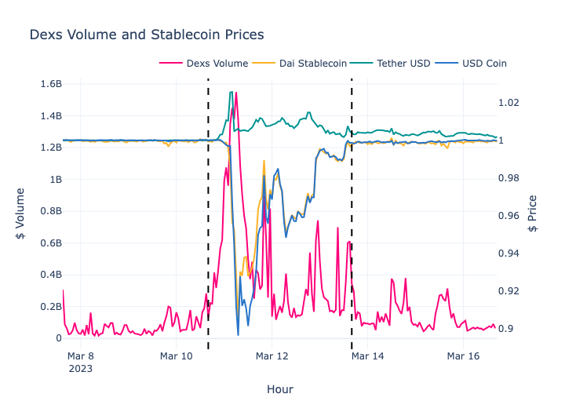

Based on Dexs volume and stablecoin prices volatility, we can safely conclude that the depeg lasted 3 days, started at around 4pm on Mar 10, 2023, and ended at around 4pm on Mar 13, 2023.

During depeg, Dexs volume per hour peaked at \$1.54B at around 6am Mar 11, 2023. Around that time, USDC and Dai bottomed at around \$0.9. Meanwhile, Tether price was greater than \$1, peaked at \$1.02.

## Volume Breakdown

### By Dex

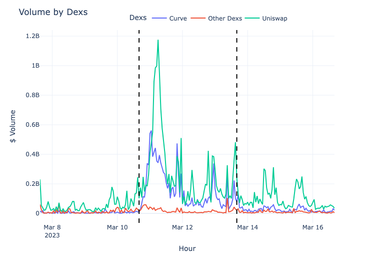
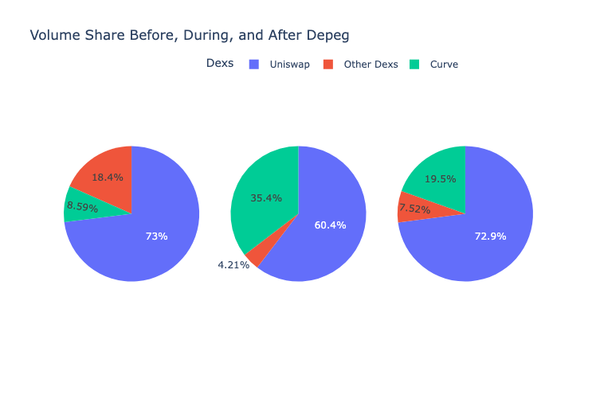

Uniswap and Curve account for more than 90% of total Dexs volume.

During depeg:

-   At first, volume on Curve rose faster than on Uniswap (till 1am Mar 11). After that, volume on Uniswap surpassed Curve and peaked when depeged stablecoins made the lowest low.
-   Curve saw its share in total Dexs volume 4x to 36% from 9%. Meanwhile, Uniswap's share decreased to 60% from 85%.

➡️ *The liquidity move started on Curve first then Uniswap and Other Dexs*.

After depeg, Uniswap regained share from Curve.

### By Pool Type

::: callout-note
Stablecoins identified as all coins in the stablecoin list of Defillama [here](https://defillama.com/stablecoins/Ethereum).
:::

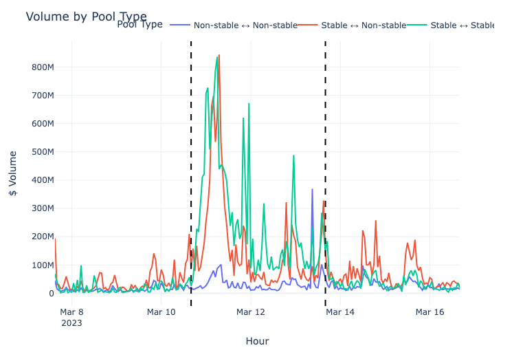
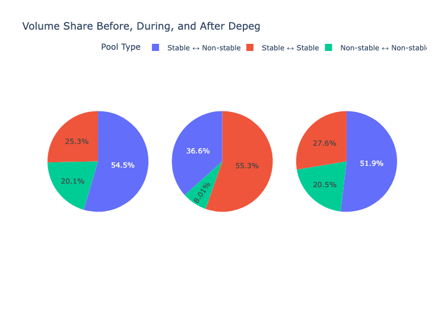

During depeg:

-   Volume in Stable ↔️ Stable pools rose faster than in Stable ↔️ Non-stable pools when depeged stablecoins price were making lower lows. Volume in the latter peaked after but higher than volume in the former (\$846M vs \$834M per hour).
-   When depeged stablecoins price started to recover and made higher highs:
    -   Volume in Stable ↔️ Non-stable pools dropped rapidly and stayed below \$400M per hour. Meanwhile, volume in Stable ↔️ Stable pools was more volatile, dropped and rose rapidly, made other 2 highs above \$500M.
    -   Volume in Non-stable ↔️ Non-stable pools only peaked at \$380M per hour at 9am Mar 13, when USDC and DAI price were about to reclaim \$0.99.
-   Overall, Stable ↔️ Stable accounts for more than half total volume, increased to 54% from 16% before depeg. Meanwhile, Stable ↔️ Non-stable lost its share in total volume to 38% from 60% before depeg.

➡️ *The liquidity move started in Stable ↔️ Stable pools first then in Stable ↔️ Non-stable, and Non-stable ↔️ Non-stable pools*.

After depeg, Stable ↔️ Non-stable pools regained share from Stable ↔️ Stable pools.

### By Swap-to Coins

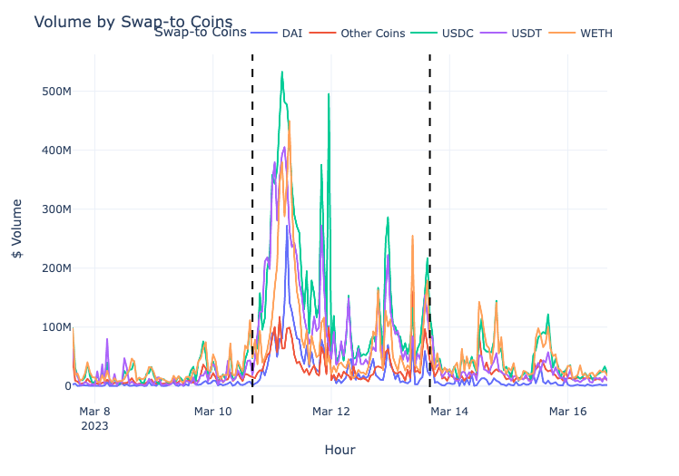
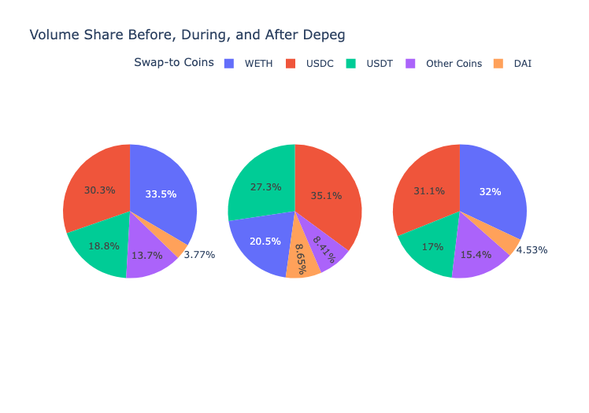

Top 4 Swap-to Coins including USDC, USDT, WETH, and DAI account for as high as 91% (during depeg) in total Dexs volume.

During depeg:

-   Before 2am Mar 11, when USDC and DAI price were about to breakdown \$0.99, volume swap-to USDT was as high if not higher than volume swap-to USDC.
-   When the prices broke down \$0.99, volume swap-to USDC and DAI rose higher while volume swap-to USDT dropped.
-   3 stablecoins USDC, USDT, and DAI increased their share in total Dexs volume. Meanwhile, WETH lost the most share to 21% from 36%.

➡️ *Liquidity moved to USDT first then to USDC and DAI when their prices broke down \$0.99*.

After depeg, USDT gained share from USDC in total Dexs volume, increased to 16% from 12%. Meanwhile, USDC's share decreased to 29% from 34%. However, recently, USDC has been regaining share, see @sec-recent.

Next, let's examine net liquidity in-flow in each period to see which coins did traders flee to.

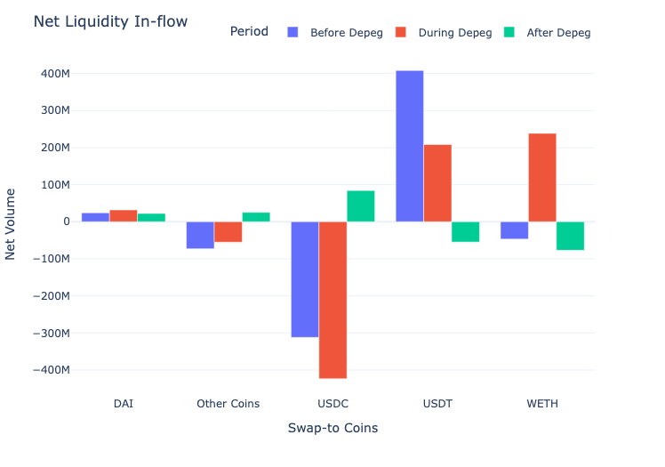

During depeg:

-   USDT and WETH saw the most net liquidity in-flow, added \$309M and \$232M respectively.
-   USDC and Other Coins saw the most net liquidity out-flow, lost \$159M and \$423M respectively.

After the depeg, liquidity flow to USDT, WETH, and USDC reversed.

➡️ *During depeg, before depeg stablecoins price broke down \$0.99, the liquidity move started on Curve first (then on Uniswap and other Dexs), where traders fled to USDT from those stablecoins in Stable ↔️ Stable pools. When stablecoins price broke down \$0.99, traders partially swapped back to those stablecoins and partially swapped to non-stablecoins. When depeg stablecoins price bottomed and then started to recover, liquidity was mostly moved between Stable ↔️ Stable, and Stable ↔️ Non-stable pools*.

## Liquidity Flows

::: callout-note
If not specify, liquidity flow of a coin in this section is total of both directions flow-in/out.
:::

### Uniswap

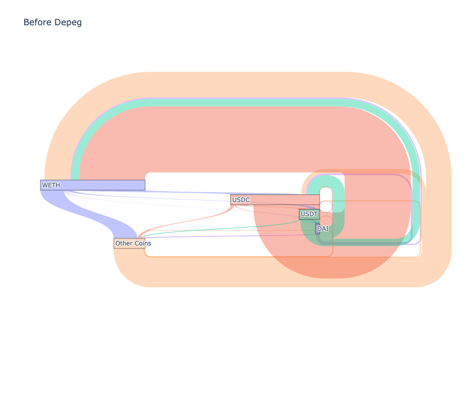
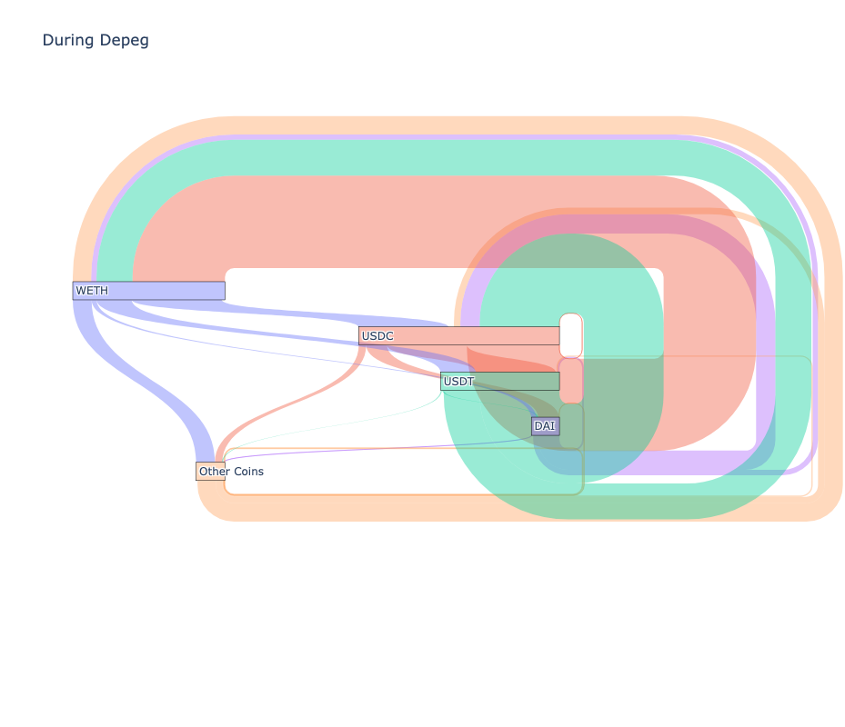
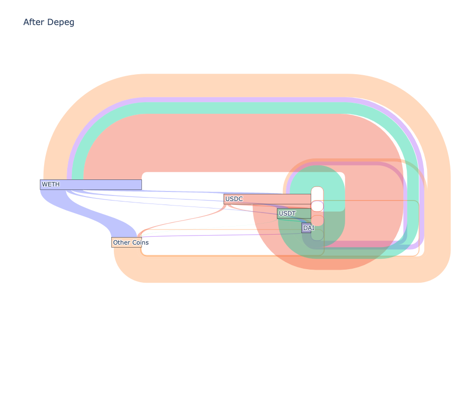

Before depeg, USDC ↔️ WETH was the biggest flow with \$2.1B, and more than double the second biggest flow, which was WETH ↔️ Other Coins. Meanwhile, USDC ↔️ USDT was the third biggest flow with \$476M.

During depeg:

-   Uniswap saw the rise of Stable ↔️ Stable pools, specifically is the USDC ↔️ USDT flow.
-   USDC ↔️ WETH was still the biggest flow with \$7.2B (\~3x vs Before depeg). However the flow which increased the most was USDC ↔️ USDT with \$6.3B (\~13x vs Before depeg).
-   Other noticable increases were USDT ↔️ WETH: added \$2.8B from \$0; USDC ↔️ DAI: 43x to \$1.5B from \$35M.

After depeg, the flows looked similar to before depeg.

### Curve

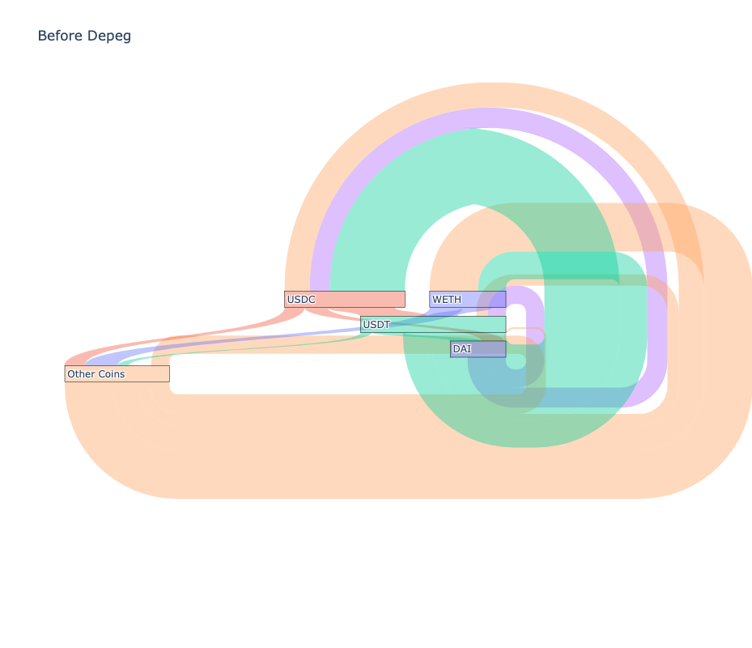
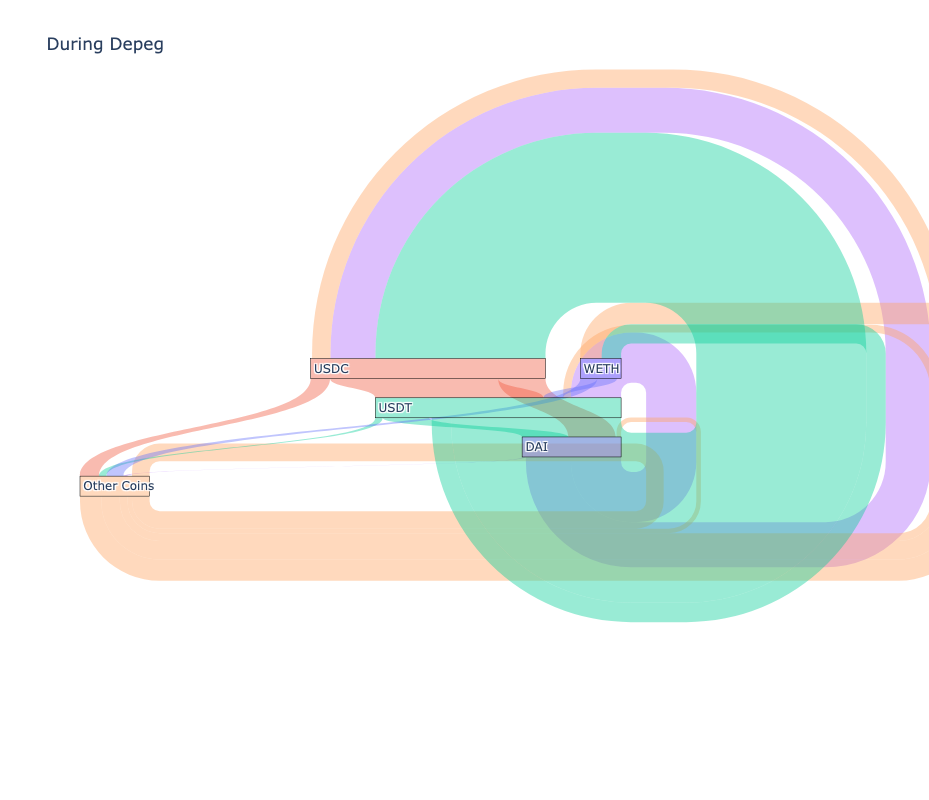
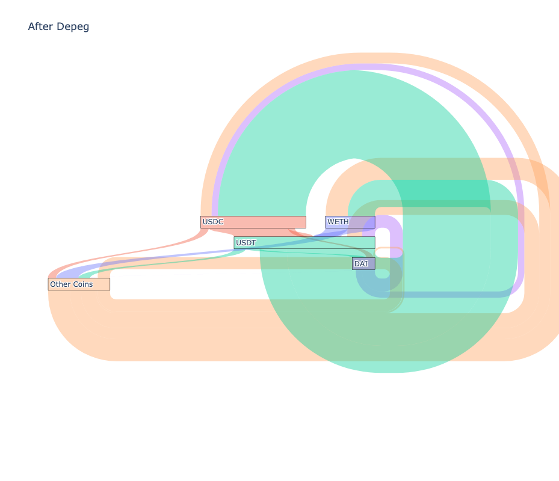

-   During depeg:
    -   Unlike Uniswap, on Curve, Stable ↔️ Stable pools are dominant all the time, mostly attributed to USDC ↔️ USDT flow.
    -   The main difference vs before depeg was flows to and from DAI, which replaced WETH as the third most volume swap-to and swap-from coin.
    -   Total liquidity flow in/out DAI 38x to \$3.4B from \$90M before depeg.

After depeg, WETH reclaimed the third posistion.

### Other Dexs

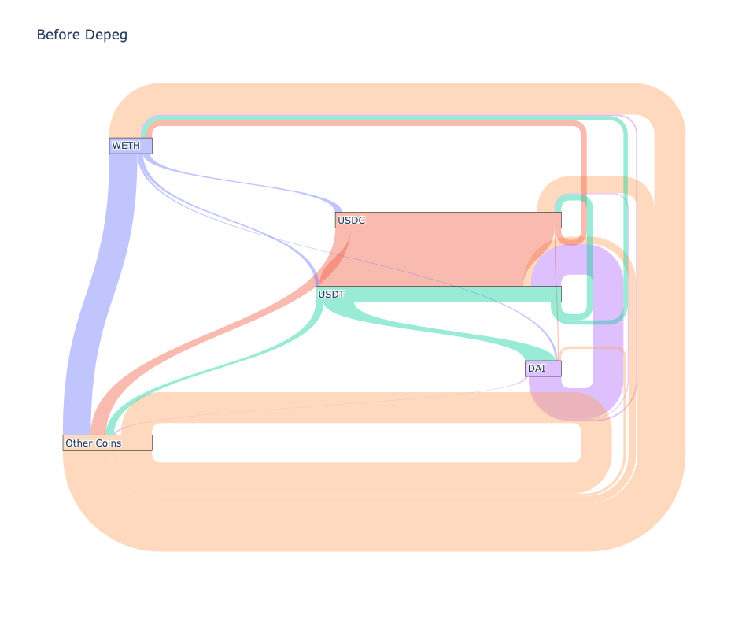
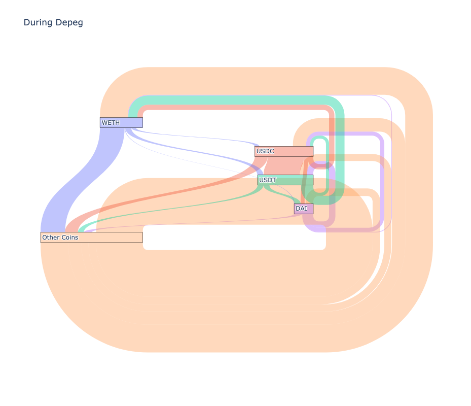
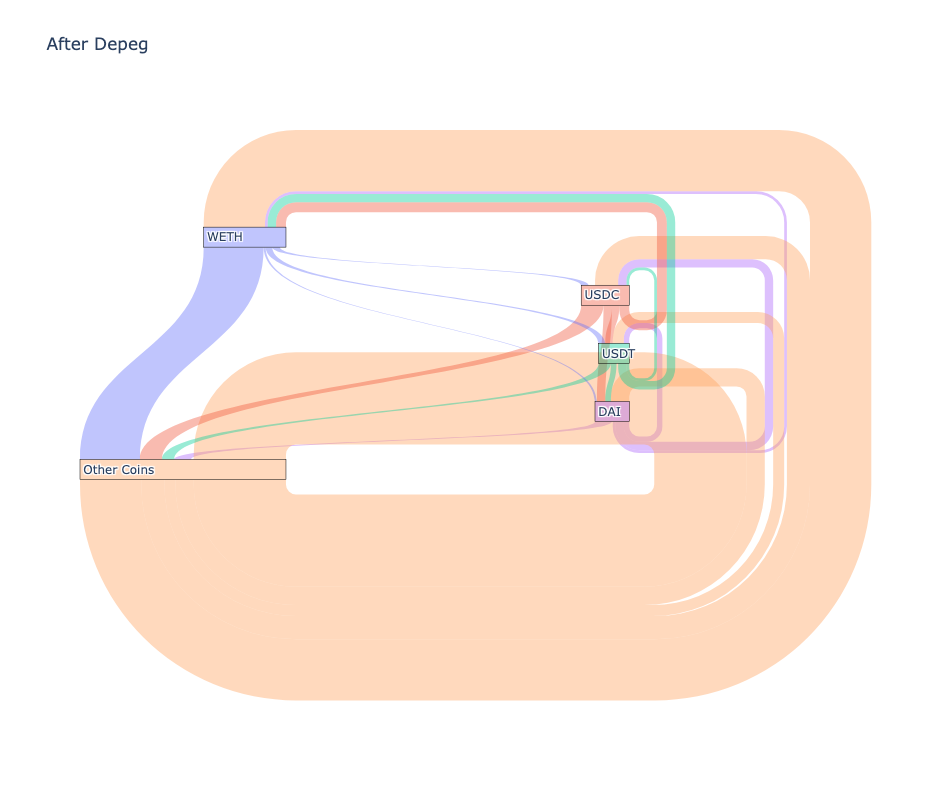

Since depeg began, bb-a-USDC and bb-a-DAI (Balancer Boosted Aave stable coins) have de-throned WETH, and replaced USDC in liquidity flow on Other Dexs.

## Is USDT the new go-to stablecoin in Defi? {#sec-recent}

To answer the question, let's look at share of daily volume flow in/out of stablecoins since Mar 1, 2023 to date.

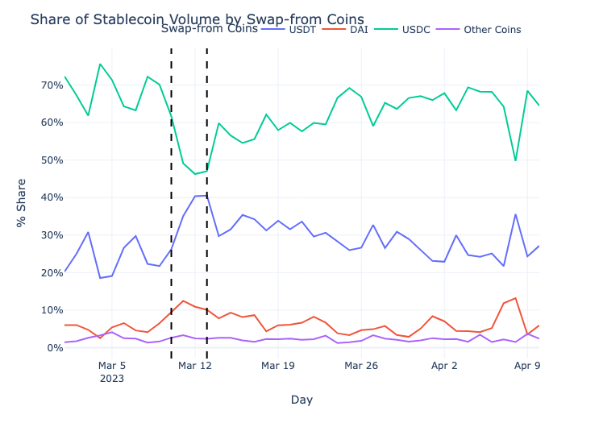
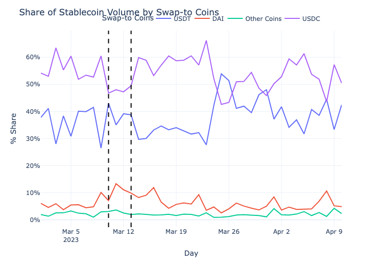

During depeg (Mar 11 - Mar 13), USDT was in the trend of closing the gap with USDC in daily volume share:

-   as low as 6% gap in swap-from volume,
-   as low as 8% gap in swap-to volume.

However, after depeg, USDC has regained its dominance.

# Conclusion

Last several years, Tether has been criticized for being shady in managing their asset, rumored as a soon-to-burst bubble. On the opposite end was Circle which had been called safe and transparent by Crypto community. However, due to the banking crisis, the SVB collasp specifically, Circle suddenly became Tether, USDC was temporarily replaced by USDT as the go-to stablecoin in Defi. Though USDC is regaining share in Defi volume, the depeg event has definitely affected the consensus among fiat-peg Stablecoins in general and Circle/USDC brand specifically.

During the depeg event, Uniswap and Curve are the 2 places where actions (liquidity flee, arbitrage) happened. The actions happened on Curve first, like a prep phase where liquidity moved from about-to-depeg stablecoins to USDT. Then when the depeg actually happened, it mostly happened on Uniswap, where liquidity moved back and forth among USDC, USDT, DAI and WETH.

# Appendix {.appendix}

-   Summary in my [twitter thread](https://twitter.com/0xphu/status/1646108856039383040?s=20).

-   [Data source](https://flipsidecrypto.xyz/) and [Queries](https://github.com/lequangphu/lequangphu.github.io/tree/main/blog/posts/uniswap-stablecoin-depeg/queries).