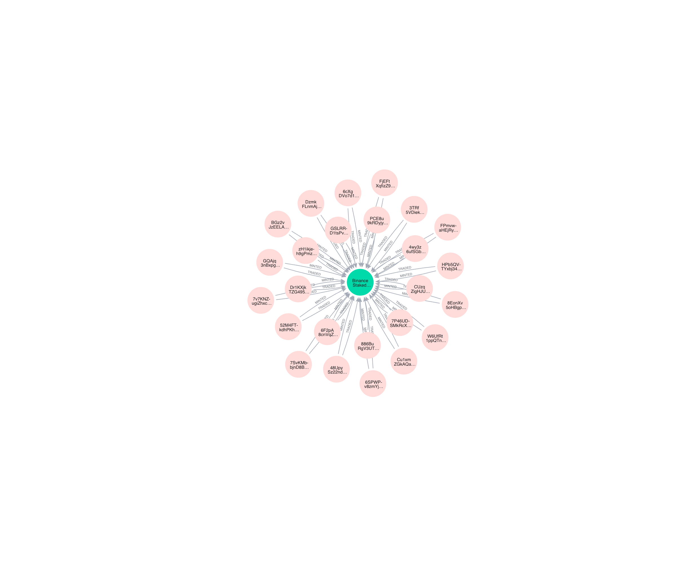
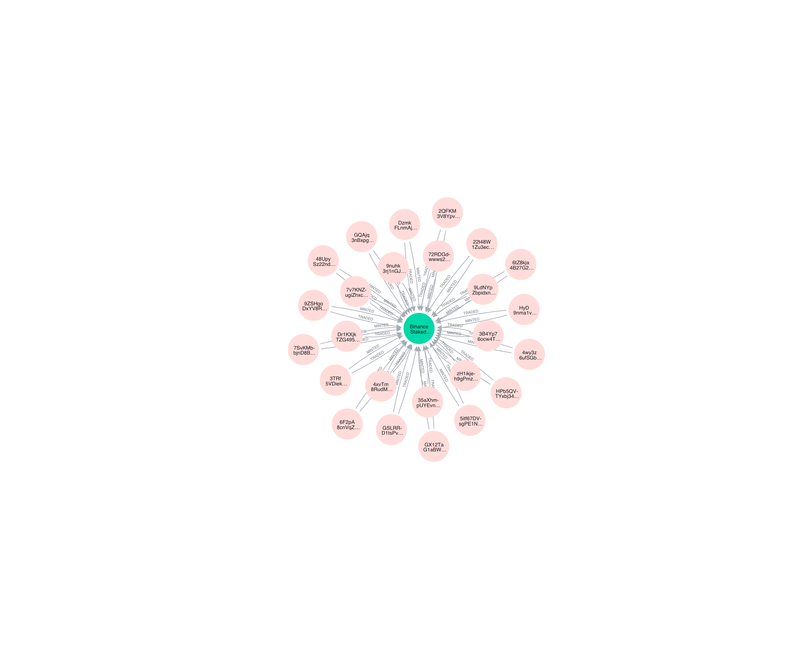

# Overview of BNSOL: Binance Staked SOL

BNSOL, or Binance Staked SOL, is a liquid staking token developed by Binance as part of its staking services on the Solana blockchain. Launched in September 2024, it enables users to stake Solana (SOL) tokens while preserving liquidity and earning network staking rewards. Unlike traditional staking, which locks assets and incurs opportunity costs, BNSOL represents the staked SOL position in a transferable and tradable form, allowing integration with decentralized finance (DeFi) protocols and other Binance products. This product addresses the limitations of native Solana staking by providing flexibility without forgoing yield.

# Metrics

2.5 thousands wallets minted 18.5 millions BNSOL.

1.3 thousands wallets burnt 6.5 millions BNSOL.

So roughly 3:1 ratio of mint to burn amount, and 2:1 ratio of mint to burn wallet.

Total transfer volume of BNSOL is 83.5 millions from 151 thousands wallets, and to 155 thousands wallets.

Below are weekly Mint, Burn, and Transfer volume of BNSOL.

65 thousands traders traded 451 thousands BNSOL.

1314 is the number of wallets which minted and also traded BNSOL. Below are the wallets in graph:

All 1314 wallets

Top 25 wallets by BNSOL minted

Top 25 wallets by BNSOL traded
